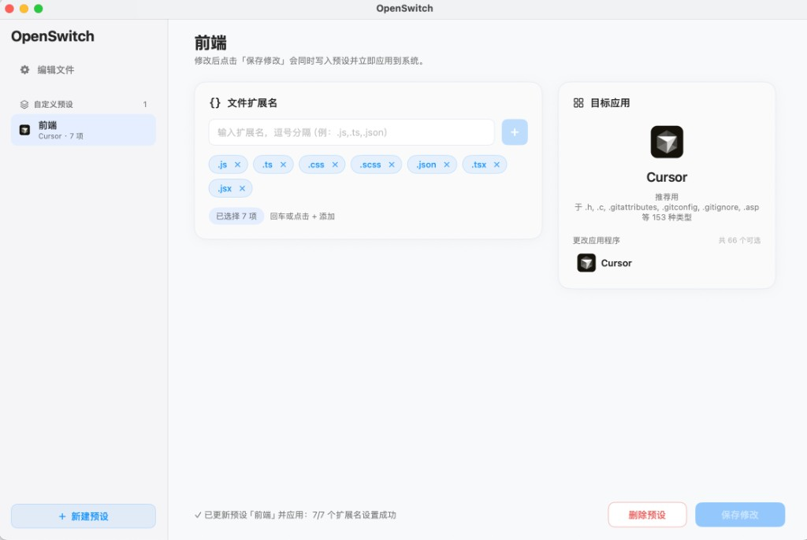

# OpenSwitch

OpenSwitch 是一个面向 macOS 的文件默认打开方式管理工具。  
目标是将「逐个扩展名手动设置默认应用」变成「按规则一键切换」。



> 把一组扩展名（如前端的 `.js .ts .tsx .jsx .css .scss .json`）打包成预设，  
> 一键切到 Cursor、VSCode 或任何你喜欢的编辑器，告别系统设置里一个个改。

## 项目目标

- 快速为单个文件扩展名切换默认打开应用
- 批量为多个扩展名切换到同一应用
- 保存并复用「扩展名集合 + 目标应用」预设，实现一键切换
- 提供可追溯、可协作的 AI 驱动开发流程

## 核心能力（MVP）

1. **单扩展名切换**
  - 输入或选择扩展名（例如 `md`、`txt`、`json`）
  - 选择目标应用
  - 一键应用系统默认打开方式
2. **批量扩展名切换**
  - 一次选择多个扩展名
  - 统一设置为同一目标应用
  - 支持覆盖已有映射
3. **预设管理**
  - 保存常用预设（例如「开发模式」「文档模式」）
  - 一键应用预设到当前系统
  - 保留最近一次切换记录，支持快速回滚

## 计划中的技术方案

- **平台**：macOS（原生应用）
- **UI**：SwiftUI
- **系统能力**：LaunchServices、UniformTypeIdentifiers
- **数据存储**：本地 `Application Support`（JSON 或 Plist）

## 快速开始

```bash
swift build           # 编译
swift run             # 启动桌面窗口
swift test            # 运行单元测试
```

启动后将显示 OpenSwitch 的桌面窗口，可直接执行扩展名映射设置。

> 系统要求：macOS 13 及以上，Swift 6.1（Xcode 16+）。

## 安装（Release DMG）

从 [Releases](https://github.com/YaoKaiLun/OpenSwitch/releases) 下载 DMG 后：

1. 打开 DMG，**双击 `Install OpenSwitch.command`**（推荐，会自动复制到「应用程序」并移除隔离标记）
2. 或手动将 `OpenSwitch.app` 拖入「应用程序」文件夹，然后在终端执行：

```bash
xattr -cr /Applications/OpenSwitch.app
```

> macOS 从浏览器下载的应用会附带隔离属性（quarantine）。未做 Apple 公证的开源应用可能提示「已损坏，无法打开」，执行上述步骤即可正常启动。

## 从源码打包

```bash
pip install Pillow          # 首次生成图标时需要
./Scripts/build.sh          # 构建 OpenSwitch.app
./Scripts/package.sh        # 打包为 DMG
```

## 目录结构

```text
.
├── .cursor/
│   └── rules/                 # Cursor 项目规则（AI 协作规范）
├── docs/
│   ├── PRODUCT_REQUIREMENTS.md
│   └── ARCHITECTURE.md
├── Sources/
│   └── OpenSwitch/
│       ├── OpenSwitchApp.swift
│       ├── MainView.swift
│       ├── AssociationViewModel.swift
│       ├── AssociationManager.swift
│       ├── InstalledAppsProvider.swift
│       ├── PresetStore.swift
│       ├── Models.swift
│       └── Utilities.swift
├── Tests/
│   └── OpenSwitchTests/        # XCTest 单元测试
├── Package.swift
└── README.md
```

## 当前状态

- 阶段：M1 开发中（已具备可运行骨架）
- 已完成：
  - 产品需求初稿
  - AI 协作规则初稿
  - 开源 README 初稿
  - SwiftUI 可运行工程骨架
  - LaunchServices 默认应用设置服务（含智能 UTI 解析）
  - 预设新建 / 编辑 / 删除 / 一键保存并应用
  - 编辑器与预设视图状态隔离（快照机制）
  - XCTest 单元测试覆盖核心逻辑（28 个用例）
- 下一步：
  - 增加历史记录与一键回滚
  - 补充错误码映射与权限提示
  - 增加 UI 测试与端到端验证

## AI 驱动开发约定

本项目采用「AI 主导 + 人工决策」的协作方式：

- 需求、设计、实现、文档保持同步更新
- 每次功能变更需同时更新 `README.md` 与相关 `docs/`
- 规则统一维护在 `.cursor/rules/`

详细规范见：`.cursor/rules/ai-driven-project.mdc`

## License

[MIT](LICENSE)